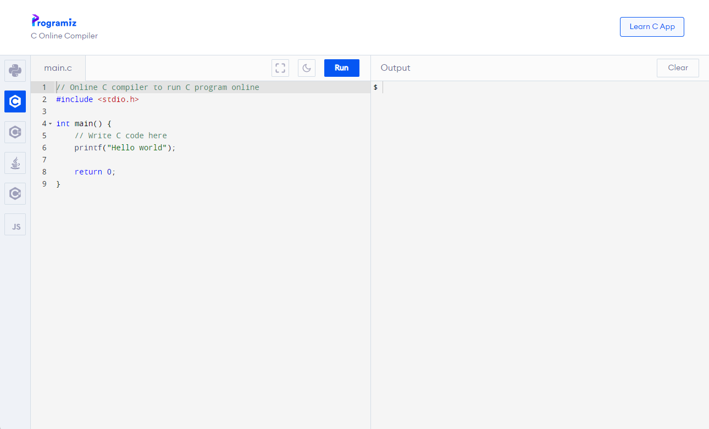
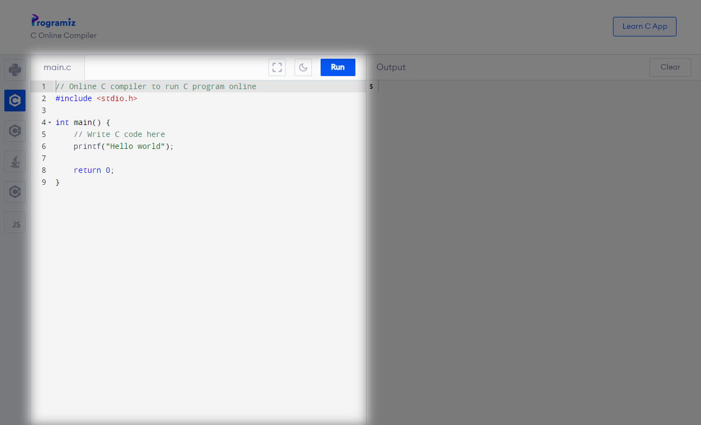
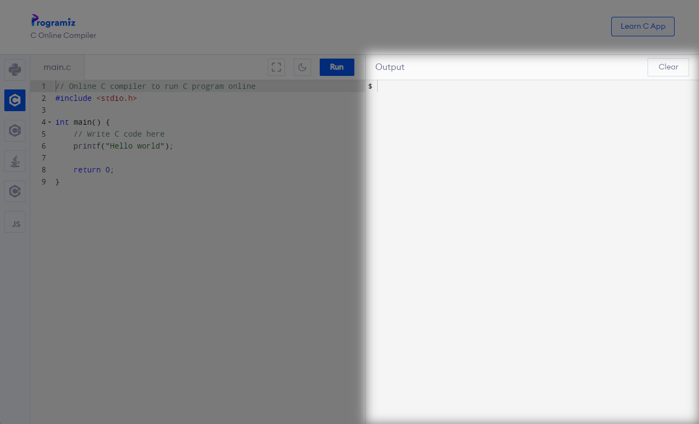

Setup 🛠️
========

We will jump straight into C programming, so you should use an online C compiler to avoid the hassle of setting up C on your own computer. This guide will go over how to use `Programiz's Online C Compiler <https://www.programiz.com/c-programming/online-compiler/>`_.

	Programiz's Online C Compiler

Code Editor
************

On the left half of the website, you should see the code editor, where you can editor your source code. This website only supported only one source code file, but that is enough for this guide. 

You can toggle fullscreen using the cornered square button, toggle night mode using the moon button, and run your C program using the "Run" button.

When you press the run button, the website will automatically compile your source code and run it.

Output
******

On the right half of the website, you should see the output. This is where while running, your program can display text and receive text input. 