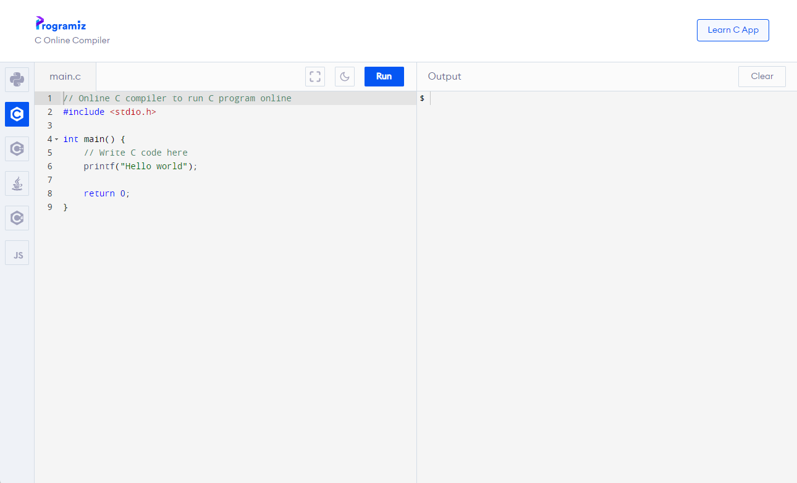

Setup 🛠️
========

We will jump straight into C programming, so you should use an online C compiler to avoid the hassle of setting up C on your own computer. This guide will go over how to use `Programiz's Online C Compiler <https://www.programiz.com/c-programming/online-compiler/>`_.

	Programiz's Online C Compiler

Code Editor
************

.. image:: img/online_c_compiler_text_editor.png
	:alt: Online C compiler
	:align: center

On the right half of the website, you should see the code editor. You can toggle fullscreen using the cornered square button, toggle night mode using the moon button, and run your C program using the "Run" button.

.. code-block:: c

	#include <stdio>

	int main() {
		printf("Hello world!");
		return 0;
	}