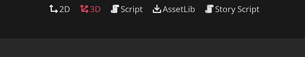
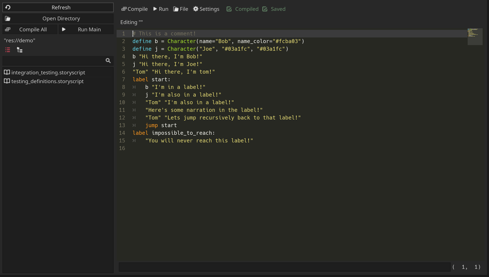
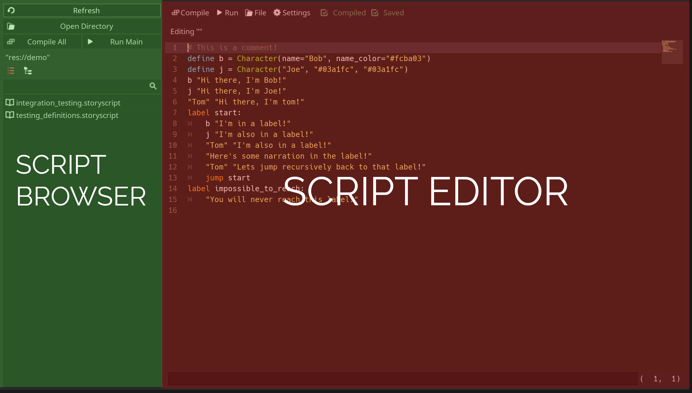
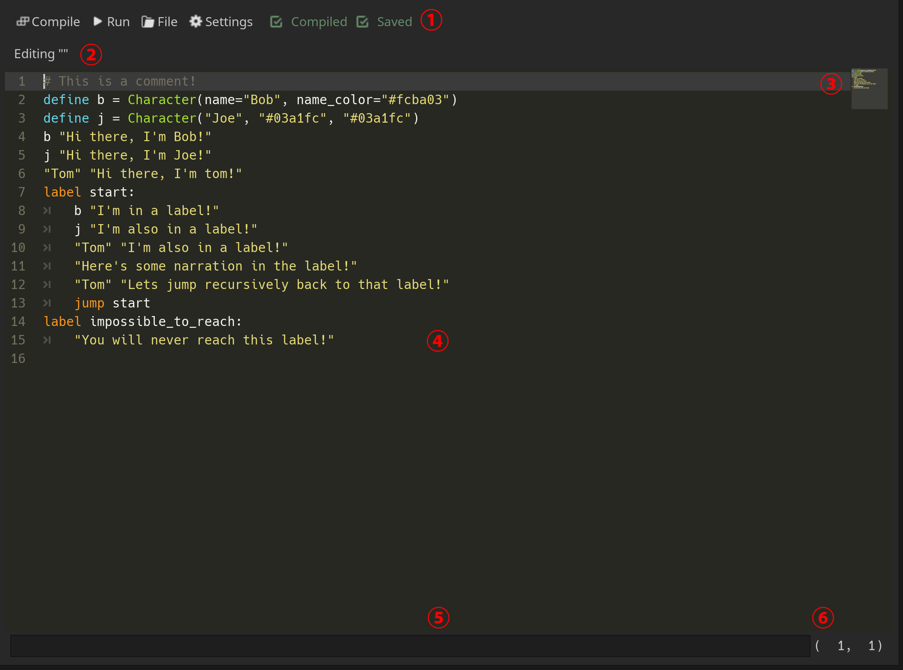
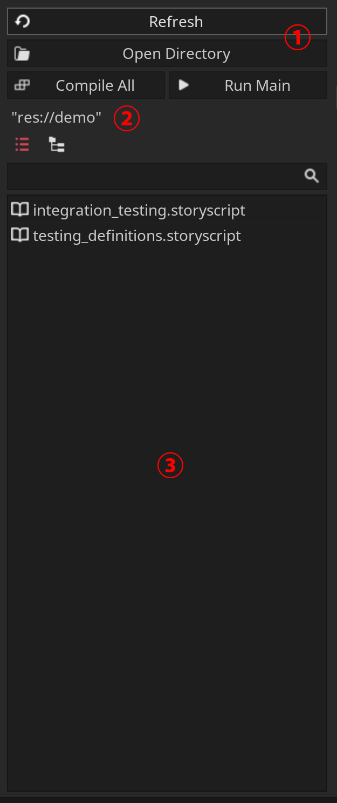

.. _doc_editor_introduction:

Introduction to Fractural VNE's Editor
======================================

.. attention:: Please make sure you have the plugin installed in your Godot project 
	before continuing. The installation instructions are :ref:`here <doc_installation>`.

.. tip:: If this is your first time using Godot, you should checkout the `Godot introduction tutorials <https://docs.godotengine.org/en/stable/getting_started/step_by_step/index.html>`_ to familiarize yourself with the Godot engine before learning how to use this plugin.

Lets get started by first explaining the plugin's UI. This plugin runs on a single window and by default, it will appear as a main screen window. You can access it by clicking on the **Story Script** button on the top of the editor.

	The **Story Script** button is found on the top of the Godot editor.

Once clicked, the story script window should open up, which looks something like this.

The story script window is where you edit and compile story script files.

The this window is separated into two sections: the script editor and the script browser, which is located to the left of the editor.

Script Editor
-------------

The script editor is where you edit story script files. This editor can be broken up into 6 parts.

Top Bar (1)
~~~~~~~~~~~~~~~~~~~~~~

The top bar is the uppermost bar of the editor, which contains various useful buttons and indicators.

From left to right, we have:

1. The compile button, which compiles the current script being edited.

2. The run button, which compiles and then runs the current script in a window separate from the editor.

3. The file button, which has a dropdown menu that lets you open a story script file, save the current story script to a file, or create a new story script.

4. The settings button, which opens a window to FracturalVNE's settings.

5. The compiled indicator, which lights up if the current script has been compiled.

6. The saved indicator, which lights up if the current script has been saved to a file.

Editing File Label (2)
~~~~~~~~~~~~~~~~~~~~~~

The editing file label displays the filepath to which file is currently being edited. If a new file is made, no filepath is shown.

Minimap (3)
~~~~~~~~~~~~~~~~~~~~~~

This is a small preview of the entire story script. You can click on a location in the minimap to jump to that location in the text editor.

Text Editor (4)
~~~~~~~~~~~~~~~~~~~~~~

The text editor takes up most of the script window and is where you edit a story script file. Line numbers are also shown on the left of the text editor.

Error Bar (5)
~~~~~~~~~~~~~~~~~~~~~~

The error bar is located on the bottom of the script window and displays any errors that happen when compiling the script.

Position Label (6)
~~~~~~~~~~~~~~~~~~~~~~

The position label indicates the current position of your cursor in the text editor. The first number shown is your cursor's line number. The second number shown is your cursor's column number.

Script Browser
--------------

The script browser lets you quickly browse and select different scripts for editing. It can be broken into 3 parts.

Top Bar (6)
~~~~~~~~~~~~~~~~~~~~~~

The top bar contains various buttons used for navigating the directory.

From left to right, top to bottom:

1. The refresh button refreshes file display in the script browser.
2. The open directory button sets the file display to show a directory.
3. The compile all button compiles all the scripts in the current directory. 
4. The run main button compiles the script named ``main.storyscript`` and then runs ``main.story``.

Current Directory Label (2)
~~~~~~~~~~~~~~~~~~~~~~~~~~~
The current directory label shows the current directory that the file display is showing.

File Display (3)
~~~~~~~~~~~~~~~~

The file display shows all the ``.storyscript`` files in a directory. The file display comes with a search bar on the top that can be used to find a file. The two buttons on the top left of the file displays lets you switch between a list view and a tree view for the current directory's files.