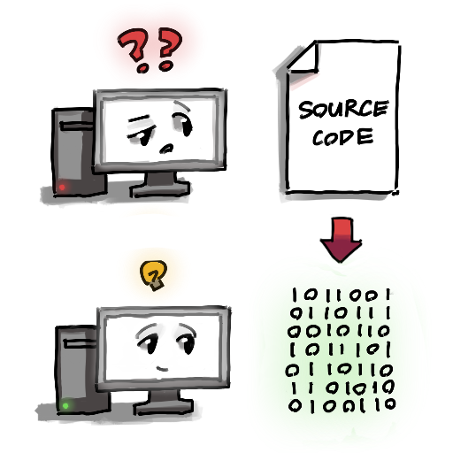

What is Programming? ❓
=======================

If you're learning about programming for the first time, you may wonder, what exactly is programming?

Programming is making instructions or **programs** that a computer can follow. Think of programs like a to-do list but for computers, where each instruction is another item on that list. 

When a computer is following instructions of a program, we say that the computer is **running** the program..

A program's instructions is called it's **source code** or **code** for short. Often times, you can't actually run code on it's own, because computers can only understand binary, which are lines of ones and zeros. Therfore we have to convert, or **compile**, our code into a **program** that can then run on out computer.